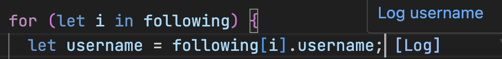

<!-- Add image -->

# Log Variable Extension

This Visual Studio Code extension adds a floating button next to JavaScript variable declarations. When clicked, it inserts a `console.log` statement to log the variable and any inline comment.

## Features

- Detects `const`, `let`, and `var` variable declarations.
- Adds a floating `[Log]` button next to the variable declaration.
- Inserts a `console.log` statement below the variable declaration when the button is clicked.

## Installation

1. Clone the repository or download the extension.
2. Open the project in Visual Studio Code.
3. Run `npm install` to install the dependencies.
4. Press `F5` to start the extension in a new Extension Development Host.

## Usage

1. Open a JavaScript file in Visual Studio Code.
2. Place the cursor on a line with a variable declaration (`const`, `let`, or `var`).
3. Observe the `[Log]` button appearing next to the variable declaration.
4. Click on the `[Log]` button to insert a `console.log` statement below the variable, including any inline comments.

## Example

```javascript
const myVariable = 42; // This is my variable
// After clicking the [Log] button, the following line will be added:
console.log('myVariable: This is my variable', myVariable);